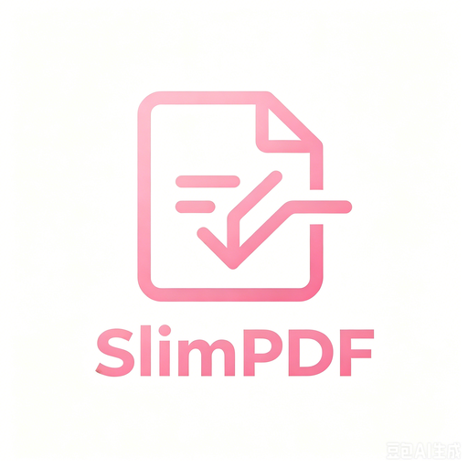
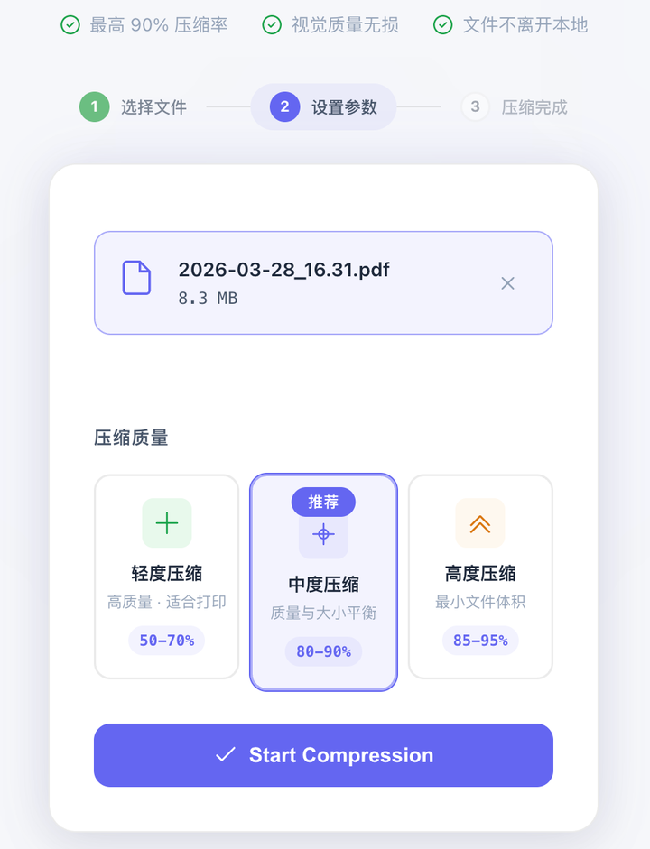

# SlimPDF

<p align="center">
  
</p>

<p align="center">
  <b>一键压缩 PDF，本地处理，隐私安全</b>
</p>

<p align="center">
  <a href="#下载">下载</a> ·
  <a href="#功能特性">功能</a> ·
  <a href="#项目故事">故事</a> ·
  <a href="#支持作者">支持</a> ·
  <a href="#贡献">贡献</a>
</p>

<p align="center">
  <a href="README.md">English</a> · <a href="README.zh-CN.md">简体中文</a>
</p>

---

## 📸 预览

<p align="center">
  
</p>

> 拖拽文件 → 选择压缩级别 → 3 秒完成 → 下载结果

---

## 💝 项目故事

**每个开发者，都是家里的"IT 部门"。**

你有没有这样的经历？

周末晚上，老婆发来一个 80MB 的扫描件："这个 PDF 太大了，微信发不出去，帮我压一下。"

你打开终端，输入 `gs -sDEVICE=pdfwrite -dCompatibilityLevel=1.4 ...`，调参数、等进度、试了三遍才满意。

她很开心："谢谢老公！"

一周后，同样的事情又发生了一次。

第三次的时候，我突然意识到：我写了这么多年代码，做了那么多复杂的系统，却连身边最亲近的人的一个小小需求，都没有真正解决。

不是我不会写 GUI，是我从来没想过——**她值得一个一键就能用的工具**。

于是这个周末，我没有刷 LeetCode，没有看技术博客，而是坐下来，给她做了一个拖进去、点一下、等几秒就能拿到结果的 PDF 压缩器。

她现在已经不需要找我了。她自己就能搞定。

说实话，我有点失落，又有点骄傲。

**这就是我做这个项目的初衷。**

如果你也曾经是家里的"IT 部门"，如果你也想过用技术让身边的人生活得更好一点——希望这个工具能帮到你。

---

## ✨ 功能特性

| 特性 | 说明 |
|------|------|
| 🚀 **三档压缩** | 轻度（高质量）/ 中度（平衡）/ 高度（最小体积） |
| 🔒 **本地处理** | 文件不上传云端，隐私绝对安全 |
| 📉 **智能优化** | 自动检测重复图像、优化字体嵌入、转换颜色空间 |
| 🖥️ **跨平台** | macOS (Universal) / Windows (x64) |
| 🎯 **一键操作** | 拖拽 → 选择 → 完成，无需任何技术背景 |
| 🌙 **深色模式** | 支持深色/浅色/跟随系统三种主题 |

---

## 📥 下载

前往 [Releases](https://github.com/kkxwz/PDFCompressor/releases) 页面下载最新版本：

| 平台 | 下载 | 说明 |
|------|------|------|
| macOS | `SlimPDF-macOS.dmg` | Universal Binary (Intel + Apple Silicon) |
| Windows | `SlimPDF-Windows-x64.exe` | 64-bit Windows 10/11 |

### 系统要求

- **macOS**: 11.0+ (Big Sur 或更新)
- **Windows**: Windows 10 64-bit 或更新
- 无需额外安装 Ghostscript（已内嵌）

---

## 🛠️ 技术栈

- **Backend**: Python 3.10+, Flask, Werkzeug
- **Compression Engine**: Ghostscript 10.x
- **Frontend**: Vanilla JS, CSS3
- **Packaging**: PyInstaller 6.x
- **CI/CD**: GitHub Actions

---

## ☕ 支持作者

如果这个项目帮到了你，欢迎请我喝杯咖啡，让我有动力继续维护它。

<p align="center">
  <b>加入交流群</b><br><br>
  <br><br>
  <i>交流使用心得、反馈问题、分享压缩技巧</i>
</p>

> 💡 **如果群二维码失效了**，请扫下方「加我微信」，备注"PDF"，我拉你进群。

<p align="center">
  <b>加我微信</b><br><br>
  
</p>

---

## 🤝 贡献

欢迎提交 Issue 和 Pull Request！

### 开发环境

```bash
# 克隆仓库
git clone https://github.com/kkxwz/PDFCompressor.git
cd PDFCompressor

# 安装依赖
pip install -r requirements.txt

# 本地运行
python app.py
```

### 构建

```bash
# macOS
bash scripts/build_mac.sh

# Windows
scripts\build_windows.bat
```

---

## 📜 License

[MIT](LICENSE) © [shaonaiyi@163.com](mailto:shaonaiyi@163.com)

---

<p align="center">
  <i>为身边最重要的人而写。</i>
</p>
